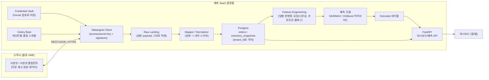

# 아키텍처: 사방넷 연동 판매예측 SaaS

물류 중소기업 고객사의 사방넷 데이터를 수집해 판매량을 예측하는 멀티테넌트 SaaS의
데이터 파이프라인 설계 문서.

## 0. 설계 원칙

1. **고객사 로그인 비밀번호를 절대 다루지 않는다.** 온보딩 시 고객사가 사방넷에서
   직접 발급한 API 키(연동키 또는 Access/Secret Key)를 등록받는다. 이 SaaS는
   그 키의 권한 범위 안에서만 데이터에 접근한다.
2. **테넌트 격리를 처음부터 스키마에 반영한다.** 모든 데이터 테이블에 `tenant_id`를
   두고, 애플리케이션 레벨 + DB 레벨(RLS 또는 쿼리 스코핑) 양쪽에서 강제한다.
3. **외부 API 스펙 변경의 영향을 격리한다.** 사방넷 원문 스펙을 아직 확정하지 못했으므로,
   `client`(원시 API 호출)와 `mapper`(내부 스키마로 변환)를 분리해 스펙이 바뀌어도
   내부 모델/예측 로직은 그대로 두고 mapper만 교체하면 되게 한다.
4. **폴링 기반을 기본 전제로 한다.** 사방넷이 웹훅을 제공하는지 미확인이므로,
   Celery Beat으로 테넌트별 주기적 폴링을 우선 구현하고, 나중에 웹훅이 확인되면
   같은 ETL 경로에 이벤트 기반 트리거만 추가한다.

## 1. 전체 데이터 흐름

## 2. 온보딩 플로우 (고객사가 늘어날 때 반복되는 절차)

1. 고객사가 사방넷(또는 풀필먼트) API 부가서비스에 직접 가입 → API 키 발급
2. 우리 플랫폼 관리자 화면에서 `Tenant` 생성
3. 고객사가 발급받은 키를 우리 온보딩 폼에 입력 → 서버에서 즉시 암호화(Fernet, 테넌트별
   envelope key) 후 `api_credentials` 테이블에 저장. 평문은 메모리에서만 존재하고 로그에도 남기지 않는다.
4. Sandbox 키가 있다면 먼저 sandbox로 커넥션 테스트 → 성공 시 실키 등록 안내
5. `ingestion_schedule`에 테넌트 등록 → Celery Beat이 주기적 폴링 시작
6. 첫 폴링 성공 시 최소 N일치 과거 데이터가 쌓일 때까지는 "데이터 수집 중" 상태로
   대시보드에 표시 (예측은 최소 데이터량 확보 전까지 비활성화)

## 3. 데이터 모델 (요약)

| 테이블 | 역할 | 비고 |
|---|---|---|
| `tenants` | 고객사(물류 SME) | |
| `api_credentials` | 테넌트별 사방넷 API 키 (암호화) | 1 tenant : N credential (통합관리/풀필먼트 등 채널별) |
| `channels` | 판매 채널(오픈마켓 등) | 사방넷이 여러 쇼핑몰을 통합하므로 채널 단위 관리 |
| `skus` | 품목 마스터 | 예측 대상의 기본 단위 |
| `orders` / `order_items` | 정규화된 주문/주문항목 | 원본 API 응답을 mapper가 변환한 결과 |
| `inventory_snapshots` | 시점별 재고 스냅샷 | 재고 회전율, 과잉/부족 판정에 사용 |
| `raw_ingestion_payloads` | 원본 응답 원문 보관 | 재처리/디버깅/스펙 변경 대응용 |
| `forecasts` | 품목·일자별 예측 판매량 | 모델 버전/정확도 함께 저장 |
| `ingestion_runs` | 폴링 실행 로그 | 실패 재시도, 모니터링 |

`orders`, `inventory_snapshots`, `forecasts` 등 핵심 테이블은 전부 `tenant_id`를 갖고,
애플리케이션 레이어의 모든 쿼리는 현재 요청의 tenant 컨텍스트로 스코핑된다(§5 참고).

## 4. 수집(ingestion) 파이프라인 상세

1. **스케줄링**: Celery Beat이 활성 테넌트 목록을 조회해 각 테넌트에 대해
   `pull_orders(tenant_id)`, `pull_inventory(tenant_id)` 태스크를 큐에 넣는다.
   테넌트별로 다른 주기(예: 주문 15분, 재고 1시간)를 둘 수 있게 `ingestion_schedule`
   테이블에서 주기를 관리한다.
2. **증분 수집**: 마지막 성공 수집 시각(`ingestion_runs.last_cursor`)을 기준으로
   변경분만 요청한다 (사방넷이 증분 조회를 지원하는지는 §미확인 항목, 미지원 시
   전체 재조회 후 우리 쪽에서 diff).
3. **Raw landing**: API 원본 응답을 가공하지 않고 `raw_ingestion_payloads`에 그대로
   저장한다. 이후 mapper 로직에 버그가 있어도 원본으로 재처리할 수 있다.
4. **정규화(mapper)**: 원본을 `orders/order_items/inventory_snapshots` 스키마로 변환.
   품목 코드 매핑, 상태값 정규화, 타임존 처리를 이 레이어에서 전담한다.
5. **적재**: `INSERT ... ON CONFLICT`로 멱등하게 upsert (주문번호+테넌트 unique key).
6. **관측성**: 각 실행을 `ingestion_runs`에 기록(성공/실패, 건수, 소요시간). 실패 시
   지수 백오프로 재시도, N회 연속 실패 시 알림.

## 5. 멀티테넌시 & 보안

- **자격증명**: 절대 평문 저장 금지. Fernet(대칭키) + 키 자체는 KMS/Secrets Manager
  등 별도 관리. 로그/에러 메시지에 키가 노출되지 않도록 마스킹.
- **데이터 격리**: 애플리케이션 레벨에서 모든 리포지토리 함수가 `tenant_id`를 필수
  인자로 받도록 강제(누락 시 타입 에러). 가능하면 Postgres RLS(`current_setting('app.tenant_id')`)로
  이중 방어.
- **레이트리밋 존중**: 사방넷 rate limit이 확인되면 테넌트별 토큰 버킷으로 호출 속도 제어.
- **감사 로그**: 어떤 관리자가 어떤 테넌트의 자격증명을 언제 조회/수정했는지 기록.

## 6. 예측 모듈

- **Feature**: 일별 판매수량, 요일/월/공휴일, 최근 N일 이동평균, 재고 소진율, 프로모션 플래그(있다면)
- **모델**: 초기에는 SKU별 SARIMAX(계절성) + XGBoost(비선형 보정) 앙상블 — 목업 화면의
  "XGBoost + SARIMAX 하이브리드"와 동일한 방향. 데이터가 충분치 않은 신규 SKU는
  카테고리 평균 기반 fallback 사용.
- **재학습 주기**: 매일 배치로 최신 데이터 반영해 재학습, 결과를 `forecasts`에 적재.
- **정확도 추적**: 실제 판매량 확정 후 MAPE 계산해 `forecast_accuracy`에 기록 →
  대시보드의 "예측 정확도 82%" 같은 지표로 노출.

## 7. 로컬 개발 환경

`docker-compose.yml`로 Postgres + Redis(Celery broker) + FastAPI + Celery worker/beat을
한 번에 띄운다. 자세한 실행 방법은 저장소 루트 README 참고.

## 8. 다음 실행 단계 (우선순위)

1. 파일럿 고객사 1곳 확보 → 실제 API 문서 확보해 `sabangnet_api_notes.md` 갱신
2. `integrations/sabangnet/client.py`의 TODO를 실제 스펙으로 교체
3. Sandbox로 end-to-end 수집 → 적재 검증
4. 최소 3개월치 데이터 확보 후 예측 모델 정확도 검증
5. 검증되면 두 번째 고객사 온보딩으로 멀티테넌트 경로 실증
